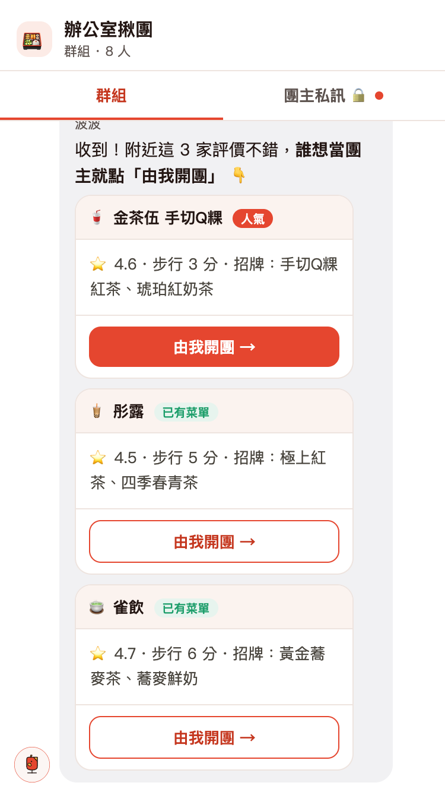
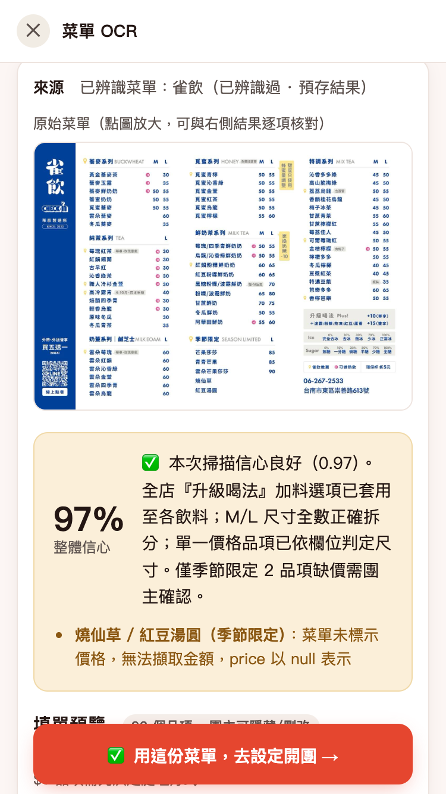
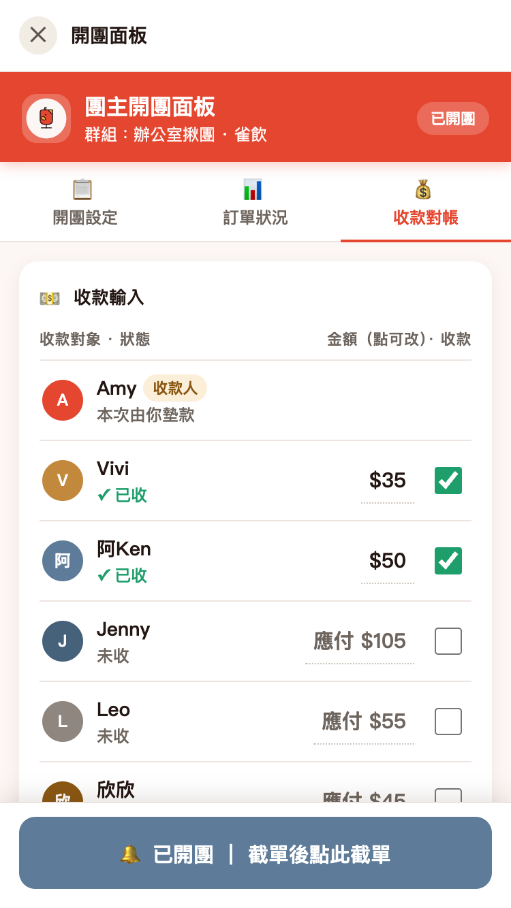
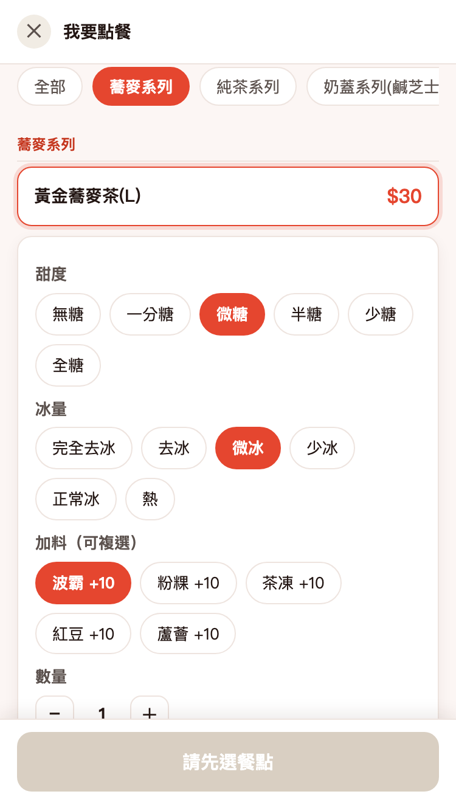
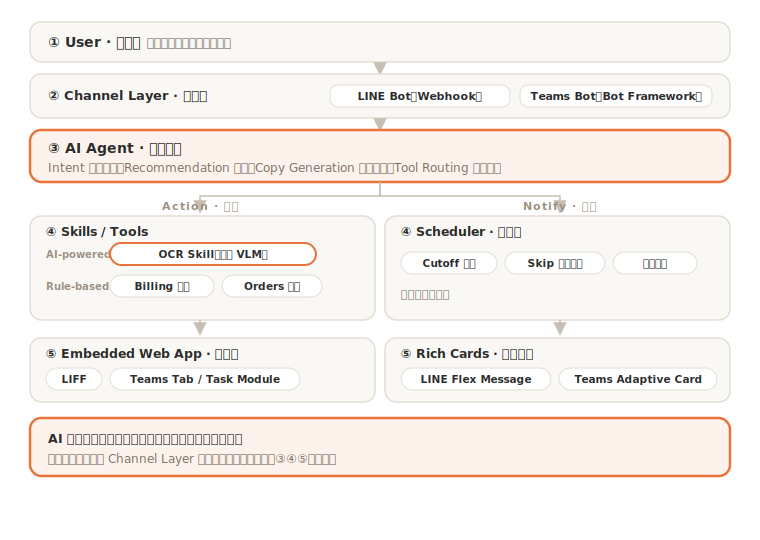

#  波波 ── 辦公室開團 AI Agent

把辦公室團購（找店 → 開單 → 點餐 → 缺貨換單 → 截單 → 算錢對帳）整條流程自動化的 AI Agent，內嵌在 LINE 裡，未來可擴充到 Microsoft Teams。

> 產品設計／原型作品集。菜單辨識這類 AI 本來就會出錯，這個專案在處理的是：怎麼把它包成團主敢用、公司敢上線的流程。

## Live Demo — 整合流程

**▶ https://achubuman.github.io/bobo-ai-agent/

用手機開，或把瀏覽器拉窄到手機寬度，就是 LINE 裡的樣子。免金鑰、可離線。模擬在 LINE 裡的完整流程，一支手機從頭走到尾：

群組 @波波 揪團 → AI 推薦店家 → 團主在私訊編輯菜單（菜單 OCR）→ 一鍵開團 → 成員點餐 → 缺貨自動通知改單 → 截單 → 收款對帳。

> 聊天為 LINE 原生模擬，菜單 OCR／開團面板／點餐頁皆為內嵌網頁（對應實際的 LINE LIFF）。

### 畫面預覽

<table>
<tr>
<td align="center"><br><sub>群組揪團 → AI 推薦</sub></td>
<td align="center"><br><sub>菜單 OCR 辨識</sub></td>
</tr>
<tr>
<td align="center"><br><sub>團主開團面板 · 收款對帳</sub></td>
<td align="center"><br><sub>成員點餐頁</sub></td>
</tr>
</table>

## 產品文件

| 文件 | 說明 |
|---|---|
| [產品需求文件 PRD](docs/PRD.md) | 問題定義、Goals、功能 → 目標 → 評估對照、需求與驗收標準、成功指標、實作狀態 |
| [OCR 測試與發現](docs/OCR_testing_and_findings.md) | 測試計畫、KPI，與三個 finding（高信心幻覺／手寫刪除／輸出截斷）—— PRD 分軸治理決策的證據來源 |

## 各模組原型

| 檔案 | 說明 |
|---|---|
| [menu_ocr_demo.html](menu_ocr_demo.html) | **菜單 OCR**：上傳菜單照片 → 多模態模型辨識成可點餐填單表。含 10 張真實菜單範例（免金鑰）、信心分級、抗幻覺擋開團、團主策展、類別橫向切換 |
| [bobo-admin-panel-prototype.html](bobo-admin-panel-prototype.html) | **團主開團面板**：開團設定、訂單管理、缺貨換單、外送費分攤、收款對帳（四種分帳模式）|
| [bobo_order_form.html](bobo_order_form.html) | **成員點餐頁**：選品項 → 糖／冰／加料 → 送出，回傳團主訂單 |

## 系統架構



五層：使用者 → 通道層（LINE / Teams Bot）→ AI Agent（單一，tool-using）→ 核心工具（OCR Skill 含 VLM／分帳／訂單）＋ 排程器 → 呈現層（LIFF 操作頁 / 訊息卡片）。

核心觀念：聊天機器人只是「通道」，AI 是通道背後的「大腦」；AI 只做理解與生成，金額與排程交給確定性規則。更換通道（LINE → Teams）只需替換通道層與卡片格式，核心邏輯不變。

## 真實架構版（會實際呼叫模型）

[ocr_service/](ocr_service/) — FastAPI 後端 + 前端：API key 藏在後端、由後端代呼叫 Gemini／Claude、順便解掉瀏覽器的 CORS，支援串流辨識與離線示範。OCR 系統提示詞見 [menu_ocr_prompt.md](menu_ocr_prompt.md)。

```bash
cd ocr_service
pip install -r requirements.txt
cp .env.example .env        # 填入 GEMINI_API_KEY（免費）
uvicorn app:app --reload    # 開 http://localhost:8000/
```

## 辨識品質與測試

- 用 **10 張真實菜單**測試：純飲料、正餐、套餐、手寫改價、模糊小圖、以及「非菜單」負向案例。
- **關鍵發現**：辨識結果可以分成「照抄型」（品名、印刷價格）和「推理生成型」（加購、客製選項）兩類；後者就算整體信心高，還是常常編錯。所以我沒用單一信心門檻，而是分開處理：會動到錢的（價格）嚴格擋、可事後編輯的（選項）放行。錯誤案例見 [`failure_cases/`](failure_cases/)。
- **抗幻覺**：非菜單／模糊照片不硬編價格，信心過低時擋住開團、引導重拍。
- **大菜單壓縮**：用 `store_defaults`（全店通用糖／冰／加料）把每杯重複的選項抽成一份，避免輸出 token 爆量被截斷。
- **量化評測**：以離線腳本比對辨識輸出與 ground truth，計算召回率／價格正確率／幻覺率（評測腳本本機保留）。
- **完整測試計畫、KPI 與三個 finding**（高信心幻覺／手寫刪除／輸出截斷）見 [docs/OCR_testing_and_findings.md](docs/OCR_testing_and_findings.md)。

## 核心設計原則

- **LLM 負責理解與生成**：探店推薦、菜單解析、開團文案 — 交給語言模型
- **確定性程式負責計算**：金額、對帳、截單判斷 — 不讓 AI 算數學
- **每個對外動作需人工確認**：OCR 結果一律 needs_review，發單前由團主拍板
- **抗幻覺**：辨識信心過低（模糊／非菜單）時擋住開團、引導重拍，不硬編
- **一套核心、可換通路**：核心邏輯與通道無關，LINE 先落地，上 Teams 只換通道層與卡片格式

## 如何試玩

用瀏覽器直接開任一個 `.html` 就行，不用安裝、可離線。建議從 `index.html`（整合 Demo）開始，拉成手機寬度從頭走一遍。

## 授權

程式碼與設計以 [MIT License](LICENSE) 授權。

`test_menus/`、`failure_cases/` 內的菜單照片，以及 Demo 中出現的店名／商標，版權均屬各店家所有，僅供辨識展示用途，不在 MIT 授權範圍內。
